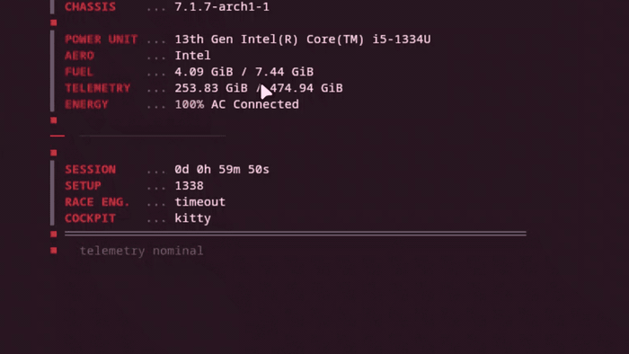

# 🔍 Log Analyzer & Alerting System


> **Blue Team / SOC Portfolio — Project 1**
> Parses SSH auth logs and Apache/Nginx access logs, detects threat patterns,
> and generates structured alert reports in text, JSON, or Markdown.



---

## ✨ Features

- **Auto-detects** log type (SSH, HTTP) by filename and content
- **SSH threat detection:**
  - Brute-force attacks (configurable threshold)
  - User enumeration (multiple invalid usernames from same IP)
  - Credential stuffing success (login after repeated failures)
- **HTTP threat detection:**
  - Directory scanning (high 404 rate)
  - High request volume (DoS / scraping)
  - Suspicious HTTP methods (DELETE, TRACE, CONNECT…)
- **Multiple output formats:** text (colored), JSON, Markdown
- **Severity levels:** CRITICAL → HIGH → MEDIUM → LOW → INFO
- Filters by **minimum severity**
- Accepts **multiple log files** in a single run
- Pure Python — **zero external dependencies**

---

## 🎬 Live demo

The demo above runs against a **live attack generator** — no canned logs:

```bash
# terminal 1 — attacks land in real time (fictional, local-only)
./samples/live_attack.sh /tmp/live_auth.log

# terminal 2 — analyze whenever you want
python log_analyzer.py /tmp/live_auth.log --type ssh --min-severity HIGH
```

Every run is different — the generator randomizes attacker IPs, usernames,
burst sizes, and occasionally lets a brute-force **succeed** (the CRITICAL case
that matters most in real SOC work).

Ready-made attack-pattern samples are included:

```bash
python log_analyzer.py samples/ssh_auth.log    # brute-force + credential stuffing
python log_analyzer.py samples/http_access.log # directory scan + suspicious methods
```

---

## 📁 Project Structure

```
log-analyzer/
├── log_analyzer.py            # Main script
├── samples/
│   ├── ssh_auth.log           # Sample SSH log — brute-force + stuffing
│   ├── http_access.log        # Sample HTTP log — 404 scan + odd methods
│   └── live_attack.sh         # Real-time attack generator (local, fictional)
├── docs/
│   └── demo.gif               # Demo recording
├── README.md
└── EXPLICACAO_TECNICA_COMPLETA.md
```

---

## 🚀 Quick Start

```bash
# Clone the repository
git clone https://github.com/Lowingx/LogAnalyzer.git
cd LogAnalyzer

# No dependencies needed — pure Python 3.10+

# Analyze a sample SSH log
python log_analyzer.py samples/ssh_auth.log

# Analyze an HTTP access log
python log_analyzer.py samples/http_access.log

# Analyze multiple files at once
python log_analyzer.py samples/ssh_auth.log samples/http_access.log

# Export a JSON report
python log_analyzer.py samples/ssh_auth.log --format json --output alerts.json

# Export a Markdown report
python log_analyzer.py samples/http_access.log --format markdown --output report.md

# Show only CRITICAL and HIGH alerts
python log_analyzer.py samples/ssh_auth.log --min-severity HIGH
```

---

## 🖥️ Usage

```
usage: log_analyzer [-h] [--type {ssh,http,syslog,auto}]
                    [--format {text,json,markdown}]
                    [--output OUTPUT]
                    [--min-severity {CRITICAL,HIGH,MEDIUM,LOW,INFO}]
                    [--quiet]
                    logs [logs ...]

positional arguments:
  logs                  Log file(s) to analyze

options:
  --type                Log type (default: auto-detect)
  --format, -f          Output format: text | json | markdown (default: text)
  --output, -o          Save report to file instead of stdout
  --min-severity        Minimum severity to include (default: LOW)
  --quiet, -q           Suppress banner and progress messages
```

---

## 📊 Example Output

```
[CRITICAL] brute_force_success_ssh  src=192.168.1.100  hits=1
  -> SSH login SUCCEEDED after 7 failures — possible credential stuffing.
  Evidence:
    Jan 10 08:01:26 sshd: Accepted password for ubuntu from 192.168.1.100

[HIGH] brute_force_ssh  src=8.8.8.8  hits=5
  -> SSH brute-force detected: 5 failed login attempts.

[HIGH] user_enumeration_ssh  src=10.0.0.5  hits=4
  -> SSH user enumeration: 4 distinct invalid usernames tried.
```

---

## 🛡️ Detection Logic

| Category | Trigger | Severity |
|---|---|---|
| `brute_force_ssh` | >= 5 failed SSH logins from same IP | HIGH |
| `brute_force_ssh` | >= 20 failed SSH logins from same IP | CRITICAL |
| `brute_force_success_ssh` | Success after >= 3 failures | CRITICAL |
| `user_enumeration_ssh` | >= 3 distinct invalid usernames | HIGH |
| `directory_scan_http` | >= 20 HTTP 404 errors from same IP | HIGH |
| `high_request_volume` | >= 50 requests from same IP | MEDIUM |
| `suspicious_http_method` | PUT / DELETE / TRACE / CONNECT / OPTIONS | MEDIUM |

Thresholds are constants at the top of `log_analyzer.py` — easy to tune.

---

## 🗺️ Roadmap

- [ ] Support for Windows Event Log (EVTX)
- [ ] GeoIP lookup for source IPs
- [ ] Slack / email alerting integration
- [ ] Time-window analysis (rate per minute, not just total)
- [ ] MITRE ATT&CK technique tagging per alert
- [ ] Watchlist / allowlist for known IPs

---

## 📄 License

MIT — use freely, learn freely.
